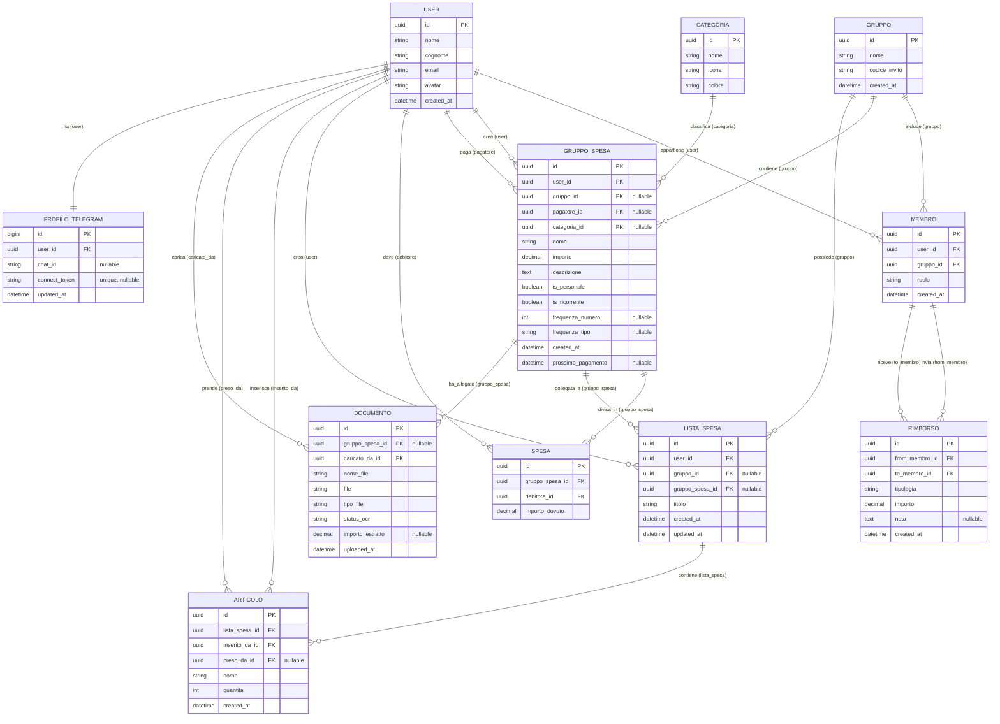

```mermaid
erDiagram
    %% DEFINIZIONE RELAZIONI (Mappatura delle chiavi esterne dei modelli Django)
    
    USER ||--o{ MEMBRO : "appartiene (user)"
    GRUPPO ||--o{ MEMBRO : "include (gruppo)"
    
    USER ||--o{ GRUPPO_SPESA : "crea (user)"
    GRUPPO ||--o{ GRUPPO_SPESA : "contiene (gruppo)"
    USER ||--o{ GRUPPO_SPESA : "paga (pagatore)"
    CATEGORIA ||--o{ GRUPPO_SPESA : "classifica (categoria)"
    
    GRUPPO_SPESA ||--o{ SPESA : "divisa_in (gruppo_spesa)"
    USER ||--o{ SPESA : "deve (debitore)"
    
    USER ||--o{ LISTA_SPESA : "crea (user)"
    GRUPPO ||--o{ LISTA_SPESA : "possiede (gruppo)"
    GRUPPO_SPESA ||--o{ LISTA_SPESA : "collegata_a (gruppo_spesa)"
    
    LISTA_SPESA ||--o{ ARTICOLO : "contiene (lista_spesa)"
    USER ||--o{ ARTICOLO : "inserisce (inserito_da)"
    USER ||--o{ ARTICOLO : "prende (preso_da)"
    
    MEMBRO ||--o{ RIMBORSO : "invia (from_membro)"
    MEMBRO ||--o{ RIMBORSO : "riceve (to_membro)"
    
    GRUPPO_SPESA ||--o{ DOCUMENTO : "ha_allegato (gruppo_spesa)"
    USER ||--o{ DOCUMENTO : "carica (caricato_da)"
    
    USER ||--|| PROFILO_TELEGRAM : "ha (user)"

    %% DEFINIZIONE ENTITÀ E ATTRIBUTI
    
    USER {
        uuid id PK
        string nome
        string cognome
        string email
        string avatar
        datetime created_at
    }

    GRUPPO {
        uuid id PK
        string nome
        string codice_invito
        datetime created_at
    }

    MEMBRO {
        uuid id PK
        uuid user_id FK
        uuid gruppo_id FK
        string ruolo
        datetime created_at
    }

    CATEGORIA {
        uuid id PK
        string nome
        string icona
        string colore
    }

    GRUPPO_SPESA {
        uuid id PK
        uuid user_id FK
        uuid gruppo_id FK "nullable"
        uuid pagatore_id FK "nullable"
        uuid categoria_id FK "nullable"
        string nome
        decimal importo
        text descrizione
        boolean is_personale
        boolean is_ricorrente
        int frequenza_numero "nullable"
        string frequenza_tipo "nullable"
        datetime created_at
        datetime prossimo_pagamento "nullable"
    }

    SPESA {
        uuid id PK
        uuid gruppo_spesa_id FK
        uuid debitore_id FK
        decimal importo_dovuto
    }

    LISTA_SPESA {
        uuid id PK
        uuid user_id FK
        uuid gruppo_id FK "nullable"
        uuid gruppo_spesa_id FK "nullable"
        string titolo
        datetime created_at
        datetime updated_at
    }

    ARTICOLO {
        uuid id PK
        uuid lista_spesa_id FK
        uuid inserito_da_id FK
        uuid preso_da_id FK "nullable"
        string nome
        int quantita
        datetime created_at
    }

    RIMBORSO {
        uuid id PK
        uuid from_membro_id FK
        uuid to_membro_id FK
        string tipologia
        decimal importo
        text nota "nullable"
        datetime created_at
    }

    DOCUMENTO {
        uuid id PK
        uuid gruppo_spesa_id FK "nullable"
        uuid caricato_da_id FK
        string nome_file
        string file
        string tipo_file
        string status_ocr
        decimal importo_estratto "nullable"
        datetime uploaded_at
    }

    PROFILO_TELEGRAM {
        bigint id PK
        uuid user_id FK
        string chat_id "nullable"
        string connect_token "unique, nullable"
        datetime updated_at
    }
```