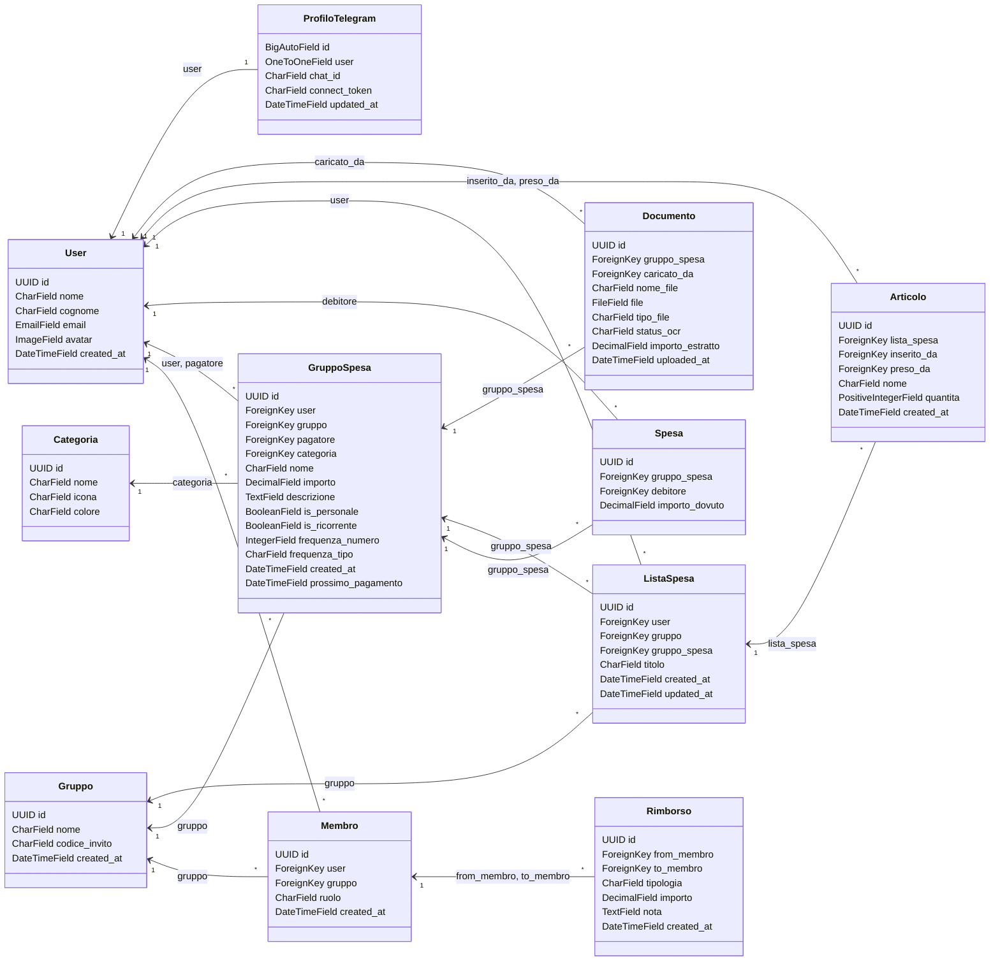

```mermaid
classDiagram
    direction LR

    class User {
        UUID id
        CharField nome
        CharField cognome
        EmailField email
        ImageField avatar
        DateTimeField created_at
    }

    class Gruppo {
        UUID id
        CharField nome
        CharField codice_invito
        DateTimeField created_at
    }

    class Membro {
        UUID id
        ForeignKey user
        ForeignKey gruppo
        CharField ruolo
        DateTimeField created_at
    }

    class Categoria {
        UUID id
        CharField nome
        CharField icona
        CharField colore
    }

    class GruppoSpesa {
        UUID id
        ForeignKey user
        ForeignKey gruppo
        ForeignKey pagatore
        ForeignKey categoria
        CharField nome
        DecimalField importo
        TextField descrizione
        BooleanField is_personale
        BooleanField is_ricorrente
        IntegerField frequenza_numero
        CharField frequenza_tipo
        DateTimeField created_at
        DateTimeField prossimo_pagamento
    }

    class Spesa {
        UUID id
        ForeignKey gruppo_spesa
        ForeignKey debitore
        DecimalField importo_dovuto
    }

    class ListaSpesa {
        UUID id
        ForeignKey user
        ForeignKey gruppo
        ForeignKey gruppo_spesa
        CharField titolo
        DateTimeField created_at
        DateTimeField updated_at
    }

    class Articolo {
        UUID id
        ForeignKey lista_spesa
        ForeignKey inserito_da
        ForeignKey preso_da
        CharField nome
        PositiveIntegerField quantita
        DateTimeField created_at
    }

    class Rimborso {
        UUID id
        ForeignKey from_membro
        ForeignKey to_membro
        CharField tipologia
        DecimalField importo
        TextField nota
        DateTimeField created_at
    }

    class Documento {
        UUID id
        ForeignKey gruppo_spesa
        ForeignKey caricato_da
        CharField nome_file
        FileField file
        CharField tipo_file
        CharField status_ocr
        DecimalField importo_estratto
        DateTimeField uploaded_at
    }

    class ProfiloTelegram {
        BigAutoField id
        OneToOneField user
        CharField chat_id
        CharField connect_token
        DateTimeField updated_at
    }

    User "1" <-- "*" Membro : user
    Gruppo "1" <-- "*" Membro : gruppo
    User "1" <-- "*" GruppoSpesa : user, pagatore
    Gruppo "1" <-- "*" GruppoSpesa : gruppo
    Categoria "1" <-- "*" GruppoSpesa : categoria
    GruppoSpesa "1" <-- "*" Spesa : gruppo_spesa
    User "1" <-- "*" Spesa : debitore
    User "1" <-- "*" ListaSpesa : user
    Gruppo "1" <-- "*" ListaSpesa : gruppo
    GruppoSpesa "1" <-- "*" ListaSpesa : gruppo_spesa
    ListaSpesa "1" <-- "*" Articolo : lista_spesa
    User "1" <-- "*" Articolo : inserito_da, preso_da
    Membro "1" <-- "*" Rimborso : from_membro, to_membro
    GruppoSpesa "1" <-- "*" Documento : gruppo_spesa
    User "1" <-- "*" Documento : caricato_da
    User "1" <-- "1" ProfiloTelegram : user
```
