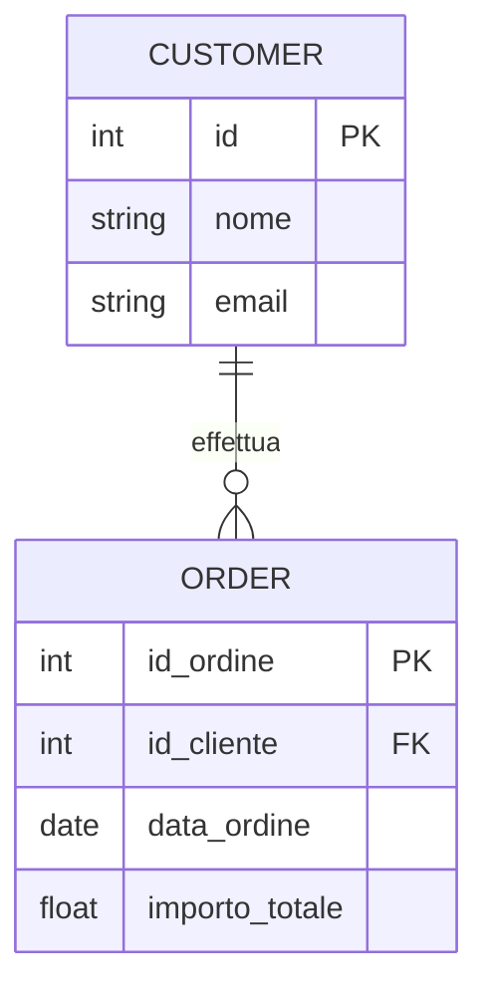
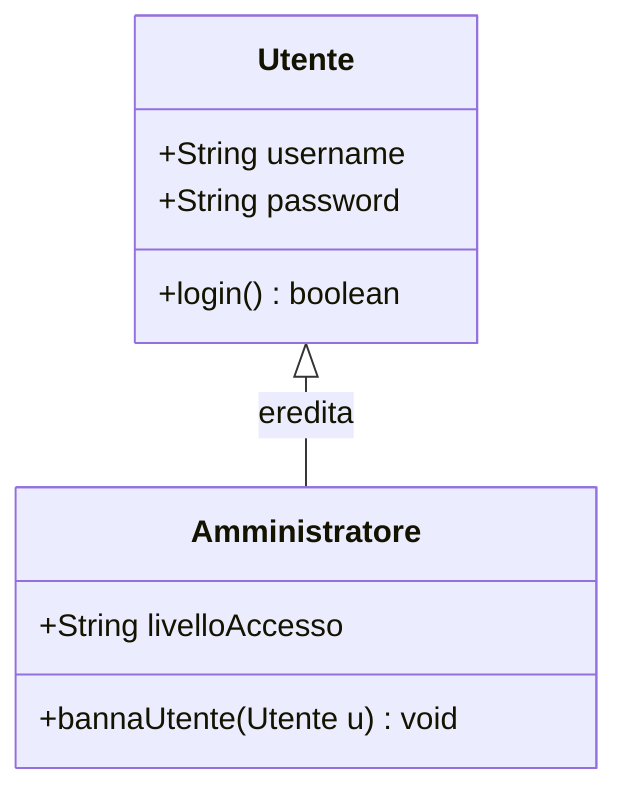

```mermaid
erDiagram
    CUSTOMER ||--o{ ORDER : "effettua"
    
    CUSTOMER {
        int id PK
        string nome
        string email
    }
    
    ORDER {
        int id_ordine PK
        int id_cliente FK
        date data_ordine
        float importo_totale
    }
```

```mermaid
classDiagram
    class Utente {
        +String username
        +String password
        +login() boolean
    }
    
    class Amministratore {
        +String livelloAccesso
        +bannaUtente(Utente u) void
    }
    
    Utente <|-- Amministratore : eredita
```